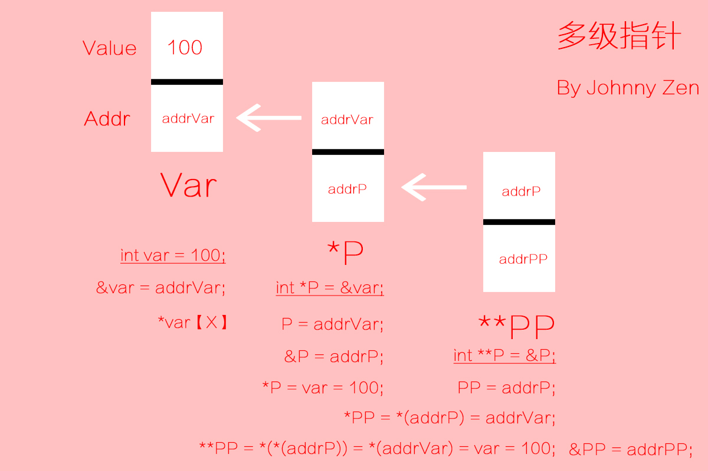

## 多益网络游戏研发面经总结

#### C++中的const有什么用？
const对象一旦创建其值就不能被改变

``` C++
//1. 定义一个常量
const int bufSize  = 512;

//2. 定义常量引用
const int ci = 1024;
const int &r1 = ci;

//3. 常量指针
//指向常量的指针不能用于改变其所指对象的值

const double pi = 3.14;
const double *cptr = &pi;

//4. 顶层const:指针本身是个常量
//5. 底层const:指针所指的对象是个常量
int i = 0;
int *const p1 = &i; 	//不能改变p1的值，这是一个顶层const
const int ci = 42;	//ci不能改变，这是一个顶层const
const int *p2 = &ci; //允许改变p2的值， 这是一个底层const
```
#### C++泛型编程

所谓泛型编程就是不考虑具体数据类型的编程模式
```C++
//template告诉编译器即将开始泛型编程
//<typename T> 告诉编译器后面代码中的T是一个泛指类型
template <typename T> 
void Swap(T &a, T &b){
	T t = a;
	a = b;
	b = t;
}
```
Swap泛型写法中的T不是一个具体的数据类型，而是泛指任意的数据类型。

函数模板其实是一个具有相同行为的函数家族，可用不同类型进行调用
1. 函数模板可以根据实参堆函数进行推导调用
2. 函数模板可以显示地指定类型参数
3. 函数模板可以重载

#### 如何解决哈希冲突？

开放地址法：当发生地址冲突时，按照某种方法继续探测哈希表中的其他存储单元，直到找到空位置为止；

再哈希法： 放发生哈希冲突时使用另一个哈希函数计算地址值，直到冲突不再发生。这种方法不易产生聚集，但是增加计算时间，同时需要准备许多哈希函数。

链接地址法： 将所有哈希值相同的key通过链表存储。 key按顺序插入到链表中。

建立公共溢出区： 采用一个溢出表存储产生冲突的关键字。如果公共溢出区还产生冲突，再采用处理冲突的方法处理

#### 图

###### 图的分类

有向图、无向图、完全图

###### 图的存储方式

1. 邻接矩阵

不足：由于存在n个顶点的图需要n\*n个数组元素存储，
<font color=red>当图为稀疏图时，使用邻接矩阵存储方法将会出现大量的0元素，这会造成极大的空间浪费。</font>

2. 邻接表表示法

邻接表由表头节点和表节点组成，图中每一个顶点均对应一个存储再数组中的表头节点。

对于无向图来说，使用邻接表进行存储也会出现数据冗余的现象。

###### 图的遍历
DFS
BFS

#### 玩家排名怎么排
1. 单服排行榜，直接用ruby on rails封装的查询语句实现（这个效率其实非常低，可以优化为redis排序）。 
2. 跨服排行榜-名人堂，设置了redis的缓存，24小时更新一次，从中心服拉数据，由于数据量小中心服接口内也是用的ruby on rails封装的查询语句实现。 
3. 跨服排行榜-异族，游戏服定期分批上报本服数据到中心服，存在redis中，设置了redis的缓存，超过50秒可以请求一次中心服，拉取最新排名，中心服接口使用redis来排名，使用了redis的zrevrange（从大到小）排序函数来实现。

#### 用快排有什么优点和缺点

优点：极快，数据移动少；

缺点：不稳定

快速排序算法的效率在序列越乱的时候，效率越高。在数据有序时，会退化成冒泡排序；

优化方法：

对于基准的选择

1. 三数取中

具体思想：对待排序序列中low、mid、high三个位置上数据进行排序，取他们中间的那个数据作为枢轴，并用0下标元素存储枢轴；

2. 随机选取基准

引入原因：在待排序列是部分有序时，固定选取枢轴使快排效率低下；

具体思想：取在待排序列中任意一个元素作为基准；

（5）优化方法

a.当待排序序列的长度分割到一定大小后，使用插入排序；

原因：对于很小和部分有序的数组，快排不如插排好。当待排序序列的长度分割到一定大小后，继续分割的效率比插入排序要差，此时可以使用插排而不是快排；

b.在一次分割结束后，可以把与key相等的元素聚集在一起，继续下次分割时，不必再对于key相等元素分割；

#### 淘宝1000-2000的商品怎么快速搜索
利用redis数据库进行搜索
也可以考虑构建索引

#### 游戏出现一个出现率很低的BUG，怎么解决
1. 从源码的角度分析问题出现的原因 ；
2. 找到特定机型，让QA想办法重现，比如借助自动化工具 ；
3. 猜测可能原因，然后在crash附件埋点抓取有效信息，上报到服务器，然后分析解决；
4. 然后在项目中加入灰度测试，定位问题，只要能复现就可以。

#### python和C++的区别，优缺点

Python是一个解释性语言，解释一句执行一句，在物理机CPU之间多了一个解释器，执行效率较低。

C++是编译型语言，执行效率较高

开发效率方面，python的开发效率高于C++

#### python的循环引用

当项目中的模块过多，或功能划分不够清晰时会出现循环引用的问题
解法1：直接导入模块名，通过模块调用其中的函数
解法2：使用延迟导入(lazy import)
在需要用的函数内部导入，或是在底部导入
解法3：重新设计代码结构，将代码和并或者分离

#### mysql 删除表的命令

drop table test;

truncate table test; 删除全部数据，保留表结构，立刻释放磁盘空间

delete from test;

delete 可以rollback撤销，truncate 不能。

#### Linux下查找当前所有进程的指令
ps命令

ps -T -p <pid> 列出进程号为 <pid> 的进程创建的所有线程

查看父进程和子进程之间的关系 pstree

#### 线程锁

多线程可以同时运行多个任务，但是当多个线程同时访问共享数据时，可能导致数据的不同步，甚至错误！使用线程锁, 可以避免这种错误。

比如你在银行取钱的同时你女朋友用支付宝取钱 不同线程同时访问同一资源 如果资源不加锁可能会导致银行亏本 卡里有100却取出200这种错误

I/O密集型操作 需要资源保持同步

#### 防止死锁、解决死锁

死锁是指两个或两个以上进程在执行过程中，因争夺资源而造成的相互等待的现象，死锁发生的四个必要条件：

互斥条件:进程对所分配的资源不允许访问，若其他进程访问该资源，只能等待，直至占有该资源的进程使用完之后释放资源；

请求与保持条件：进程获得一定的资源后，又对其他资源发出请求，但是该资源可能被其他进程占有，此时请求阻塞，但该进程不会释放自己已经占有的资源

不可剥夺条件：进程已获得的资源，在未完成使用之前，不可被剥夺，只能使用后自己释放

环路等待条件：进入死锁后，必然存在一个进程-资源之间的环行链。

防止死锁的方法即破坏上述四个条件之一

资源一次性分配，从而剥夺请求与保持条件

可剥夺资源，即当进程新的资源未得到满足时，释放已占有的资源，从而破坏不可剥夺条件

资源有序分配法：系统给每类资源赋予一个序号，每个进程按编号递增的请求资源，释放则相反，从而破环环路等待的条件。


#### 线程安全
在拥有共享数据的多条线程并行执行的程序中，线程安全的代码会通过同步机制保证各个线程都可以正常且正确的执行，不会出现数据污染等意外情况。

阻塞同步：在多个线程并发访问数据时，保证共享数据在同一个时刻只能被一个线程使用，主要的互斥同步手段有
- synchronized关键字
- 重入锁(ReentrantLock)

非阻塞同步：
该方法采用基于冲突检测的乐观并发策略。每个线程先进行操作，如果没有其他线程争用共享数据，则操作成功。如果共享数据有争用，产生冲突，那就再采取其他的补偿措施。

#### SVN
SubVersioN(SVN)是一个开源的版本控制系统，也就是说Subversion管理着随时间改变的数据，这些数据放置在一个中央资料档案库(repository)中。

#### 多级指针。你的项目里用过没有？为什么要用多级指针？


[图片来源](https://www.cnblogs.com/johnnyzen/p/7575929.html)

#### 函数指针和指针函数
1. 定义

函数指针时指向函数的指针变量

函数指针本身首先是一个指针变量，该指针变量指向一个具体的函数。这正如用指针变量可以指向整型变量、字符型、数组一样，这里是指向函数

C在编译时，每一个函数都有一个入口地址，该入口地址就是函数指针所指向的地址。 有了指向函数的指针变量，可用该指针变量调用函数

2. 用途

调用函数或做函数的参数，比如回调函数。

3. 实例
``` C
char *fun(char *p){}	//函数fun

char *(*pf)(char *p); 	//函数指针pf

pf = fun; 	//函数指针指向函数fun

pf(p);	//通过函数指针调用函数
```

#### 算法题：合并两个有序数组，先说下思路，十分钟写代码（其实就给了七分钟擦。

#### 稳定的排序算法有哪些

冒泡排序、插入排序、归并排序、计数排序

#### 项目中用了哪些数据结构算法（编了个快排蒙混过关）
并查集
#### 对互联网加班怎么看，996能接受吗（答 钱给够就接受）

#### 手机的指纹识别是怎么实现的（为什么会有这样的问题）
1. 所采用的**光学式指纹识别**，光学式的指纹识别，是通过光线照射到我们的指纹上，因为我们指纹本身就是凹凸不平的，然后光线再反射到接收器上，就可以得到我们指纹的纹路。

2. **电容式的指纹识别**是下面有一块一块的电容极板，因为我们手指的指纹是凹凸不平的，所以在我们进行指纹识别的时候，凸起的指纹线和凹下去的地方，因为距离极板的距离不一样，所以各个电容极板的电容量大小就会有差异。电容大的地方就是凸起的纹线，电容小的地方是凹下去的地方，也就是通过电容的大小，识别出指纹的纹路。

3. **超声波指纹识别**，这种就和我们熟悉的蝙蝠、船上用的声呐系统类似，发生出超声波，然后再接受反射回来的声波，就识别出来我们的指纹。

指纹识别系统就会开始找我们指纹上的一些特点，比如一些问路的开头、纹路分叉的地方或者是一小段一小段这样的纹路，作为识别的特征点，到这个地方指纹识别系统就完成了录入。